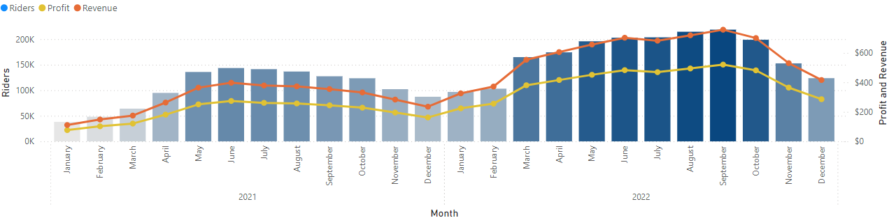
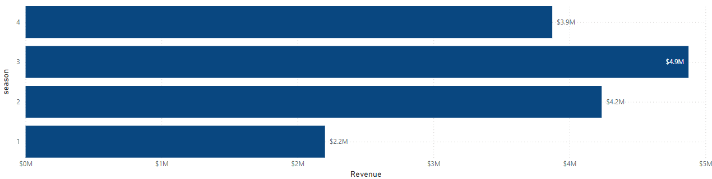
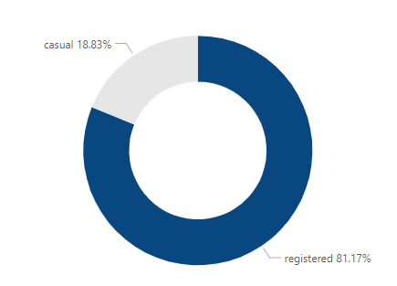

# Toman Bike Share Dashboard Development Report

## Overview
This report details the development and insights derived from the Toman Bike Share dashboard. The dashboard has been designed to meet the requirements specified in the email request, providing key performance metrics for informed decision-making.

## Requirements and Solutions

### Hourly Revenue Analysis
- **Dashboard Section**: The table displaying hourly sales data.
- **Insights**: The analysis reveals peak earnings during midday and early evening hours, specifically between 10 AM and 3 PM. These hours are the most profitable, suggesting they should be the focus for marketing efforts and operational enhancements.

| hr  | 0    | 1    | 2    | 3    | 4    | 5    | 6    |
|-----|------|------|------|------|------|------|------|
| 8   | $194 | $952 | $1,087 | $1,131 | $1,132 | $1,068 | $265 |
| 9   | $360 | $503 | $546  | $552  | $556  | $598  | $433 |
| 10  | $594 | $319 | $297  | $306  | $306  | $365  | $610 |
| 11  | $725 | $376 | $338  | $353  | $367  | $343  | $761 |
| 12  | $857 | $477 | $422  | $449  | $461  | $548  | $860 |
| 13  | $860 | $472 | $422  | $431  | $455  | $589  | $892 |
| 14  | $835 | $443 | $388  | $395  | $410  | $530  | $882 |
| 15  | $812 | $466 | $431  | $422  | $456  | $584  | $883 |
| 16  | $816 | $654 | $662  | $632  | $656  | $756  | $844 |
| 17  | $732 | $1,153 | $1,254 | $1,185 | $1,222 | $1,316 | $771 |
| 18  | $625 | $1,106 | $1,192 | $1,134 | $1,165 | $1,097 | $661 |
| 19  | $516 | $791 | $815  | $827  | $832  | $698  | $550 |
| 20  | $385 | $555 | $582  | $595  | $622  | $492  | $415 |


### Profit and Revenue Trends
- **Dashboard Section**: The line and bar chart showing riders, profit, and revenue by year and month.
- **Insights**: There is a consistent upward trend in both profit and revenue, with noticeable peaks during the summer months (June to August). This indicates strong seasonal performance and the potential for targeted promotional activities during these periods.



### Seasonal Revenue
- **Dashboard Section**: The bar chart displaying revenue by season.
- **Insights**: Summer (Season 3) generates the highest revenue at $4.9 million, followed by Fall (Season 4) with $3.9 million. Winter (Season 1) shows the least revenue at $2.2 million. This seasonal variability should inform strategic planning and resource allocation.



### Rider Demographics
- **Dashboard Section**: The pie chart showing rider demographics by rider type.
- **Insights**: The majority of riders are registered users (81.17%), with casual riders comprising 18.83%. This demographic split underscores the importance of retaining registered users through loyalty programs and incentives.


## Design and Aesthetics
The dashboard has been designed using Toman Bike Share's company colors and an intuitive layout to ensure ease of navigation. Each section has been organized to provide clear and actionable insights.

## Recommendation on Raising Prices Next Year
Based on the analysis, a phased approach to raising prices is recommended:

- **Peak Hours**: Introduce a slight price increase during the most profitable hours (10 AM to 3 PM). Monitor the impact on ridership and revenue.
- **Seasonal Adjustments**: Implement higher rates during summer months (June to August) when demand is highest. Offer promotional discounts during the winter months to maintain rider engagement.

### Rationale
- **High Demand Periods**: Riders are less price-sensitive during peak times and seasons, allowing for a price increase without significantly affecting ridership.
- **Seasonal Pricing**: Adjusting prices based on seasonal demand ensures revenue optimization and maintains a balanced flow of ridership throughout the year.

## Conclusion
The Toman Bike Share dashboard provides comprehensive insights into hourly revenue, profit and revenue trends, seasonal revenue, and rider demographics. By leveraging these insights, Toman Bike Share can strategically enhance its operations, marketing efforts, and pricing strategies to maximize profitability and sustain growth.

## Files Included
- `Toman_Bike_Share_Dashboard.pbix`: Power BI dashboard file.
- `CSV files` used in the analysis.
- `scripts/`: SQL scripts used for data processing.
- `README.md`: Project documentation.

## Data Analysis and SQL Query
The following SQL query was used to combine and analyze data from multiple tables:

```sql
WITH cte AS 
(SELECT * 
    FROM bike_share_yr_0
UNION ALL
SELECT * 
    FROM bike_share_yr_1)
SELECT 
dteday,
season,
cte.yr,
weekday,
hr,
rider_type,
riders,
price,
cogs,
riders*price as revenue,
riders*price - cogs*riders as profit
    FROM cte
LEFT JOIN cost_table
ON cte.yr = cost_table.yr

```
# Viewing the Dashboard

## Install Power BI Desktop
Download and install Power BI Desktop from the [Microsoft Power BI website](https://powerbi.microsoft.com/).

## Open the Dashboard
Open the `Toman_Bike_Share_Dashboard.pbix` [file](C:/Projects/sql%20project%20bike%20data/Toman%20Bike%20Share%20Dashboard.pbix) using Power BI Desktop. You can also view a PDF of the dashboard [here](C:/Projects/sql%20project%20bike%20data/Toman%20Bike%20Share%20Dashboard.pdf).

# Setting Up the Database

## Install PostgreSQL
Ensure PostgreSQL is installed on your system.

## Create Tables and Import Data
Use the SQL script in the scripts folder to create tables and import data.

## Run the Query
Use the SQL query provided above to combine and analyze the data.

# Project Insights

## Hourly Revenue Analysis
- Peak earnings occur between 10 AM and 3 PM.
- Wednesday and Friday show significantly higher sales.

## Profit and Revenue Trends
- There is a consistent upward trend in profit and revenue, peaking during summer months.

## Seasonal Revenue
- Summer generates the highest revenue, followed by Fall, Spring, and Winter.

## Rider Demographics
- The majority of riders are registered users (81.17%).

# Recommendations
- **Optimize Peak Hours:** Focus marketing and operational efforts during peak hours.
- **Target High-Profit Days:** Implement promotions on Wednesdays and Fridays.
- **Seasonal Promotions:** Develop seasonal campaigns to maintain engagement during off-peak seasons.
- **Loyalty Programs:** Introduce loyalty programs for registered riders.

# Contact
For any questions or feedback, please contact Sumraan Nazir at [sumraannazir@gmail.com](mailto:sumraannazir@gmail.com).
